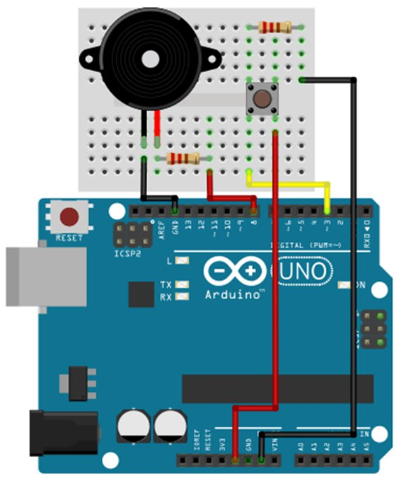

# MenZ-TONE #
***

|初心者工作|お手軽演奏|ポータブル|
|:---:|:---:|:---:|
|6歳児用知育セット並！|指一本残ってればOK！|ポケットサイズ！|

### これは何？ ###

楽器は何もできないけど、音楽を演奏したい人必見！
指一本あれば演奏できる！

### 特徴 ###
1鍵盤だけで曲を奏でます
それっぽいタイミングでキーを押していけば Arduino が勝手に演奏！

### どうやって作るの？ ###
<dl>
<dt>1. 必要なハードウェアを揃えましょう</dt>

|名前|型番|
|:---:|:---:|
|Arduino|UNO R3|
|ブレッドボード|-|
|圧電スピーカー|-|
|タクトスイッチ|-|
|抵抗|100Ω|
|抵抗|10kΩ|
|リード線|5本くらい|
<dt>2. 回路図の通りにパーツを接続します</dt>

<dt>3. Arduinoにプログラムファイルを書き込み、タクトスイッチを押して見ましょう！</dt>
</dl>
### どうやって連絡すれば良い？ ###

* https://twitter.com/The_MenZ3
* https://www.facebook.com/TheMenZ3/
