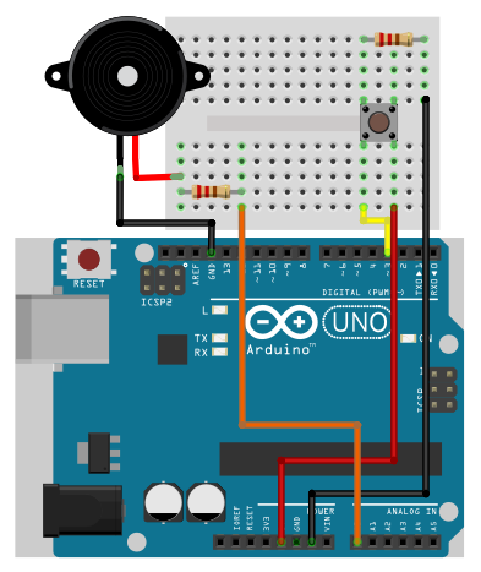

# MenZ-TONE #
***

|初心者工作|お手軽演奏|ポータブル|
|:---:|:---:|:---:|
|6歳児用知育セット並！|指一本残ってればOK！|ポケットサイズ！|

<iframe width="560" height="315" src="https://www.youtube.com/embed/f3aGDDzvwAQ" frameborder="0" allowfullscreen></iframe>

### これは何？ ###

世界最小の音ゲーマシン！  
ボタン一つに、圧電ブザー、スコアは自分の満足感！  
楽器が何もできないのに、音楽を演奏したいヤツ必見！  
指一本残ってれば演奏できるぞ！  

 
### 特徴 ###

1鍵盤だけで曲を奏でる！  
それっぽいタイミングでキーを押していけば Arduino が勝手に演奏！

 
### どうやって作るの？ ###

###### 1. 必要なハードウェアを揃えましょう  

|名前|型番|
|:---:|:---:|
|Arduino|UNO R3|
|ブレッドボード|-|
|圧電スピーカー|-|
|タクトスイッチ|-|
|抵抗|100Ω|
|抵抗|10kΩ|
|リード線|5本くらい|

###### 2.回路図の通りにパーツを接続します</dt>

###### 3. Arduinoにプログラムファイルを書き込み、タクトスイッチを押して見ましょう！

### 他の曲は無いの？ ###

songs.hに自動演奏データや曲データが入っています  
これを書き換えてArduinoに書き込みましょう  

MMLデータをMenZ-TONE用のデータにコンバートするツールを作りました  
http://www.the-menz.com/mml2tone.html

MIDIからMMLに変換するには 3ML EDITOR 2 が便利です  
http://3ml.jp/

 
### どうやって連絡すれば良い？ ###

* http://www.the-menz.com/contact.html
